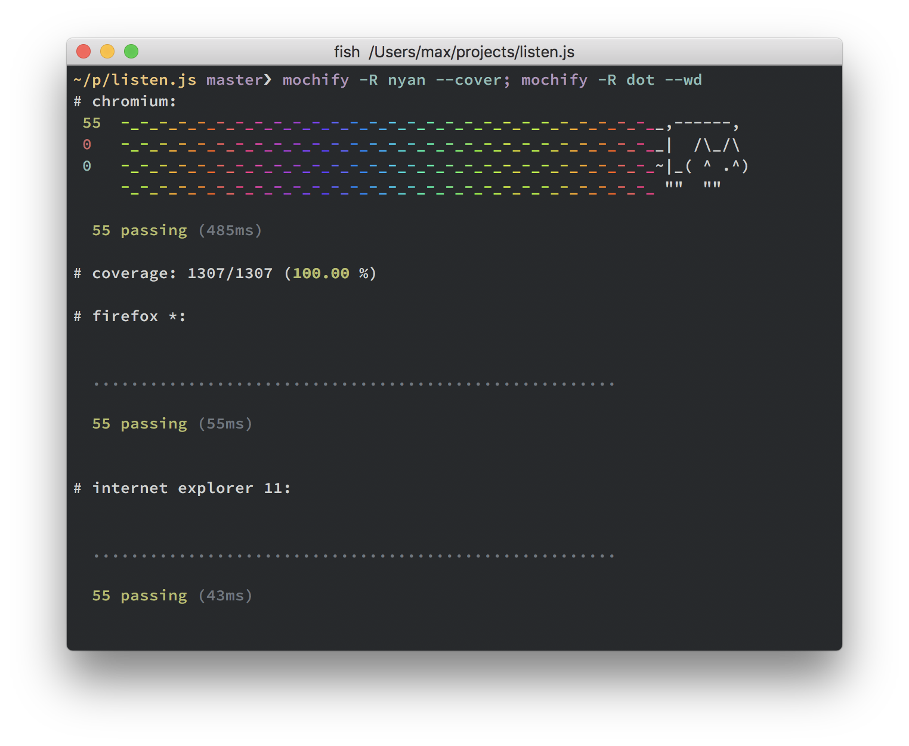

# [](https://github.com/mantoni/mochify.js/)

> TDD with Browserify, Mocha, Headless Chrome and WebDriver

[](https://github.com/mantoni/mochify.js/actions/workflows/test.yml)
[![SemVer]](http://semver.org)
[![License]](https://github.com/mantoni/mochify.js/blob/master/LICENSE)

## 🐉 REWRITE BRANCH FOR MOCHIFY 🐉

This branch is an attempt to rethink mochify from the ground up and very much
work in progress.

## Install

This will install the Mochify CLI and the puppeteer driver in your current
project and add it to the `devDependencies`:

```
npm i @mochify/cli @mochify/driver-puppeteer -D
```

[Puppeteer][] will download a recent version of Chromium. If you want to skip
the download and provide your own executable instead, define the
`PUPPETEER_SKIP_CHROMIUM_DOWNLOAD` environment variable or add this to your
`package.json`:

```json
{
  "config": {
    "puppeteer_skip_chromium_download": true
  }
}
```

For proxy settings and other environment variables, see the [Puppeteer
documentation][puppeteer-envs].

## Usage

> TODO Rewrite usage

```bash
node cli --reporter nyan
```

## Workaround for Apple Silicon

Puppeteer fails to launch on M1. Follow these steps to work around:

- Install Google Chrome
- Define these environment variables:

  ```bash
  export PUPPETEER_SKIP_CHROMIUM_DOWNLOAD=true
  export PUPPETEER_EXECUTABLE_PATH=/Applications/Google\ Chrome.app/Contents/MacOS/Google\ Chrome
  ```

## Compatibility

- v8.x
  - Node Node 12.0+, Node 14.0+, Node 16.0+
  - Mocha ^8.4
  - Browserify ^16.5
  - Puppeteer ^9.1
- v7.x
  - Node 10.0+, Node 12.0+, Node 14.0+
  - Mocha ^5.2
  - Browserify ^16.5
  - Puppeteer ^5.3
- v6.x
  - Node 6.0+, Node 8.0+, Node 10.0+
  - Mocha ^5.2
  - Browserify ^16.2
  - Puppeteer ^1.10
- v5.2+
  - Node 6.0+, Node 8.0+
  - Mocha ^4.1
  - Browserify ^15.2
  - Puppeteer ^1.0
- v5.0 - v5.1
  - Node 6.0+, Node 8.0+
  - Mocha ^4.0
  - Browserify ^14.4
  - Puppeteer ^0.13
- v4.x
  - Node 4.0+, 6.0+, Node 8.0+
  - PhantomJS 1.9, 2.0
  - Mocha ^4.0
  - Browserify ^14.4
- v3.x
  - Node 4.0+
  - Mocha ^3.2
  - Browserify ^14.1
- v2.15+
  - Browserify 13.x
- v2.14
  - Mocha ^2.3
- v2.13
  - Browserify 11.x
- v2.10 - v2.12
  - Browserify 10.x
- v2.5 - v2.9
  - Browserify 9.x
- v2.4
  - Browserify 8.x
- v2.3
  - Browserify 7.x
- v2.0 - v2.2
  - Browserify 6.x
  - Mocha 2.x
- v1.x
  - Browserify 5.x
  - Mocha 1.x
- v0.x
  - Browserify 4.x

## License

MIT

[build status]: http://img.shields.io/travis/mantoni/mochify.js.svg
[semver]: http://img.shields.io/:semver-%E2%9C%93-brightgreen.svg
[license]: http://img.shields.io/npm/l/mochify.svg
[watchify]: https://github.com/substack/watchify
[coverify]: https://github.com/substack/coverify
[istanbul]: https://github.com/gotwarlost/istanbul
[mochify-istanbul]: https://github.com/ferlores/mochify-istanbul
[webdriver]: http://www.seleniumhq.org/projects/webdriver/
[min-webdriver]: https://github.com/mantoni/min-webdriver
[saucelabs]: https://saucelabs.com
[appium]: http://appium.io
[browserstack]: https://www.browserstack.com
[mocha test runner]: https://github.com/mantoni/mocaccino.js
[consolify]: https://github.com/mantoni/consolify
[subargs]: https://github.com/substack/subarg
[through2]: https://github.com/rvagg/through2
[browserify api]: https://github.com/substack/node-browserify#methods
[glob]: https://github.com/isaacs/node-glob
[puppeteer]: https://github.com/GoogleChrome/puppeteer
[puppeteer-envs]: https://github.com/GoogleChrome/puppeteer/blob/master/docs/api.md#environment-variables
[nyc]: https://github.com/istanbuljs/nyc
